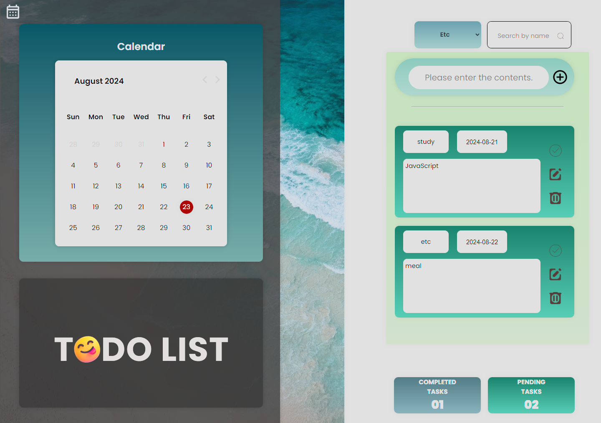

## TO DO-LIST

---

- 프로그래머스 데브코스: 클라우드 기반 프론트엔드 엔지니어링 1기 / 팀-개인 프로젝트 1차
- 개발 기간: 2024.08.15 ~ 2024.8.20
- 사용 언어: HTML5, CSS3, JavaScript

### 화면 구성

---

- 랜딩 페이지

  

- 메인 페이지
  

### 주요 기능 및 개발 내용

---

- todo list 추가(Select Category 버튼을 눌러서 원하는 카테고리를 선택 or 추가한 뒤 내용을 입력하여 추가)

  

- todo list 상태 변경(완료: 완료 버튼을 누를 경우 완료된 상태를 알 수 있게 변경, 수정: 날짜 변경은 날짜를 선택하여 변경, 내용의 변경은 수정 버튼을 통해 변경, 삭제: 삭제 버튼을 통해 삭제할 것인지 재확인 후 삭제)
- todo list 전체 항목 완료, 진행 현황 확인(todo list 추가할 때 마다 진행 항목을 카운트하고, 완료 상태로 변경할 경우 완료 항목과 진행 항목을 실시간 카운트하여 현황에 표시)

  

- todo list 검색(검색하는 내용을 포함하는 todo list 항목들만 list에 표시)

  

- calendar(기본값 : 오늘의 날짜를 자동으로 받아오는 일반적인 달력의 기능 수행(좌우버튼으로 월별 확인 가능), 추가 기능 : todo list와 연동하여 선택한 날짜의 항목들을 불러옴, 선택한 날짜의 항목이 없는 경우 기본 이미지 표시)
  
  
  

### 보완점

---

- 카테고리 선택 버튼
  - Select가 아닌 다른 방식으로 구현하여 CSS를 더 활용할 수 있었으면 좋았을 것
  - 항목 검색과 붙어있는 점을 생각하여 카테고리 선택은 항목 추가 박스에 넣고, 기존 위치에는 카테고리를 선택했을 때 list에 선택한 카테고리에 해당하는 항목들만 보여주는 기능을 넣었으면 좋았을 것
- 서버 구축, DB 연결
